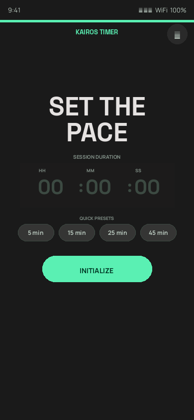
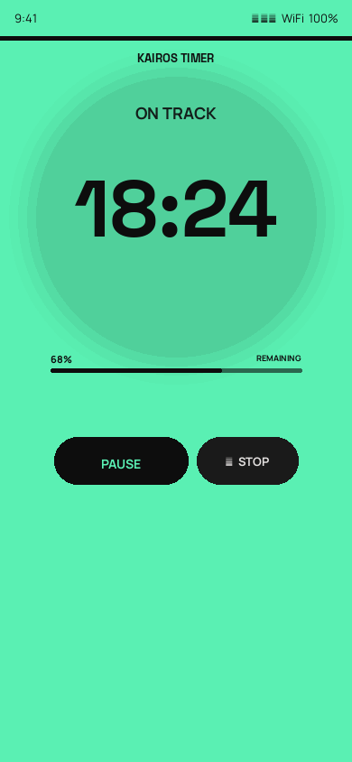
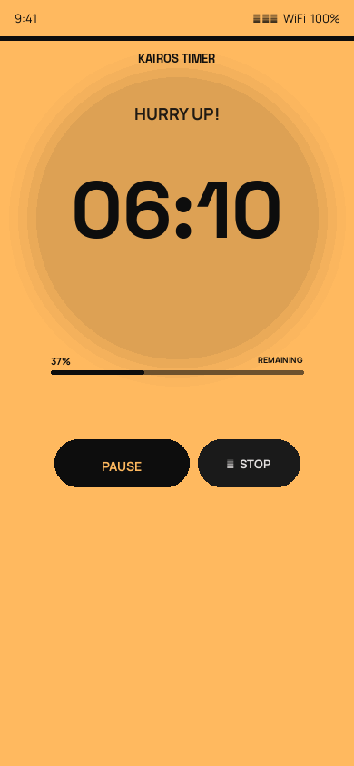
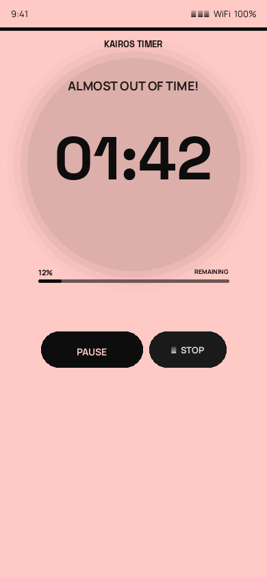
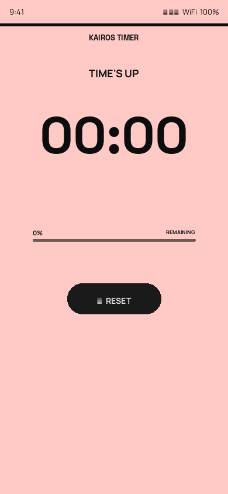
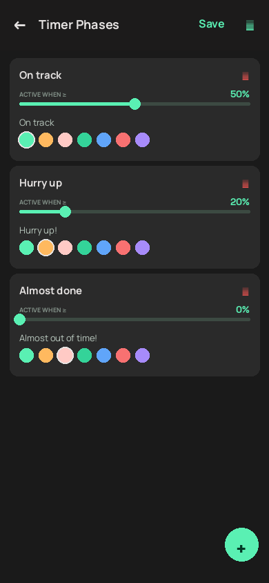
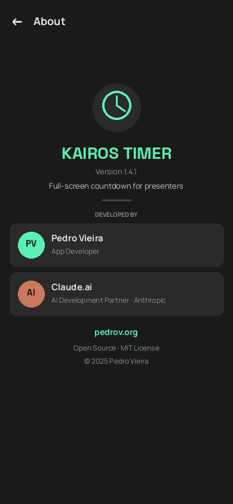

# PresentationTimer — Android App

A full-screen countdown timer built for presenters. A coloured accent bar and progress indicator show exactly where you stand — no squinting, no distractions. Dark cinematic design that keeps the focus on the clock.

---

## Screenshots

| Setup | Running — Green | Running — Yellow | Running — Red |
|:---:|:---:|:---:|:---:|
|  |  |  |  |

| Time's Up | Settings — Phases | Settings — Add Phase | About |
|:---:|:---:|:---:|:---:|
|  |  |  |  |

---

## Features

| Feature | Details |
|---|---|
| Custom duration | Set hours, minutes, and seconds before starting |
| Configurable phases | Define as many phases as you want, each with its own colour, message, and threshold |
| Aura bar | 4dp coloured bar at the top cross-fades to the active phase colour |
| Linear progress bar | Thin bar sweeps down showing time remaining at a glance |
| Animated transitions | 500 ms colour cross-fade between phases |
| Pause / Resume | Freeze the clock mid-presentation |
| Reset | Return to setup at any time |
| Screen always on | `FLAG_KEEP_SCREEN_ON` prevents display sleep |
| Flash on finish | Timer flashes when time is up |
| Dark cinematic UI | Deep dark background (#131313), Space Grotesk + Manrope typography |

---

## Default Colour Phases

| Phase | Trigger | Accent colour | Message |
|---|---|---|---|
| On track | ≥ 50% remaining | Mint green (#5AF0B3) | On track |
| Hurry up | ≥ 20% remaining | Amber (#FFB95F) | Hurry up! |
| Almost done | ≥ 0% remaining | Coral (#FFCAC5) | Almost out of time! |

All phases are fully configurable — see [User Manual](docs/USER_MANUAL.md).

---

## Tech Stack

- **Kotlin** — 100%
- **MVVM** with `ViewModel` + `LiveData`
- **View Binding**
- **Material Components** — `LinearProgressIndicator`, `MaterialButton`, `TextInputLayout`, `CardView`
- `CountDownTimer` for precise countdown
- `SharedPreferences` + JSON for persistent phase settings

---

## Project Structure

```
PresentationApp/
├── build.gradle               ← Top-level Gradle config
├── settings.gradle
├── gradle.properties
├── gradlew / gradlew.bat      ← Gradle wrapper
├── docs/
│   ├── USER_MANUAL.md
│   ├── USER_MANUAL.pdf
│   └── screenshots/
└── app/
    ├── build.gradle           ← App module (SDK, dependencies)
    └── src/main/
        ├── AndroidManifest.xml
        ├── java/org/pedrov/presentationtimer/
        │   ├── MainActivity.kt         ← UI controller
        │   ├── TimerViewModel.kt       ← Timer state & countdown logic
        │   ├── PhaseConfig.kt          ← Phase data model + JSON
        │   ├── PhasesRepository.kt     ← SharedPreferences persistence
        │   ├── SettingsActivity.kt     ← Settings screen
        │   └── PhaseAdapter.kt         ← RecyclerView adapter for phases
        └── res/
            ├── layout/
            │   ├── activity_main.xml
            │   ├── activity_settings.xml
            │   └── item_phase.xml
            └── values/
                ├── colors.xml
                ├── strings.xml
                └── themes.xml
```

---

## Getting Started

### Prerequisites

- Android Studio Hedgehog (2023.1.1) or newer
- Android SDK API 26+
- JDK 17+

### Build & Run

1. Clone the repo:
   ```bash
   git clone https://github.com/pedroaovieira/PresentationApp.git
   cd PresentationApp
   ```

2. Open in **Android Studio** → File → Open → select the `PresentationApp` folder.

3. Let Gradle sync complete.

4. Connect your Android phone (USB Debugging enabled) or start an AVD emulator.

5. Click **Run** (▶) or press `Shift+F10`.

### Build APK from the command line

```bash
export JAVA_HOME=<path-to-jdk17>
export ANDROID_HOME=<path-to-android-sdk>
./gradlew assembleDebug
# Output: app/build/outputs/apk/debug/PresentationTimer.apk
```

### Install directly via ADB

```bash
adb install app/build/outputs/apk/debug/PresentationTimer.apk
```

---

## Install on Your Phone (without a computer)

1. Go to [Releases](https://github.com/pedroaovieira/PresentationApp/releases/latest)
2. Download `PresentationTimer.apk`
3. On your phone: **Settings → Apps → Install unknown apps** → enable for your browser
4. Tap the downloaded file and follow the prompts

---

## Requirements

- Android **8.0 (API 26)** or higher
- Portrait orientation

---

## Documentation

- [User Manual (Markdown)](docs/USER_MANUAL.md)
- [User Manual (PDF)](docs/USER_MANUAL.pdf)
- [Google Play Store Guide](docs/GOOGLE_PLAY_STORE.md)

---

## License

MIT
