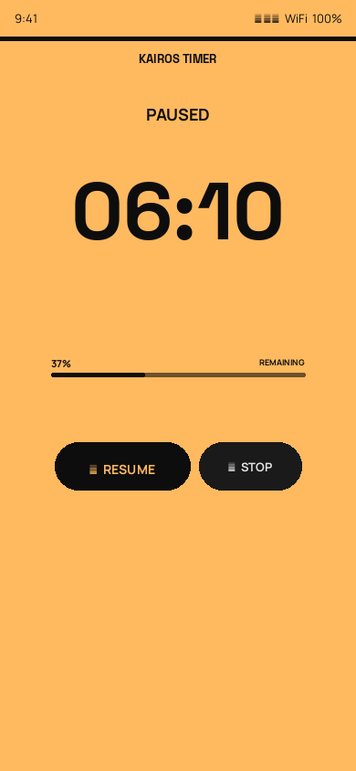

# Kairos Timer — User Manual

**Version 1.4.0**

---

## Table of Contents

1. [Overview](#1-overview)
2. [Installation](#2-installation)
3. [Quick Start](#3-quick-start)
4. [Timer Screen](#4-timer-screen)
   - [Setup](#41-setup)
   - [Running](#42-running)
   - [Paused](#43-paused)
   - [Time's Up](#44-times-up)
5. [Configuring Phases](#5-configuring-phases)
   - [Opening Settings](#51-opening-settings)
   - [Editing a Phase](#52-editing-a-phase)
   - [Adding a Phase](#53-adding-a-phase)
   - [Deleting a Phase](#54-deleting-a-phase)
   - [Saving Changes](#55-saving-changes)
6. [Phase Logic Explained](#6-phase-logic-explained)
7. [Tips for Presenters](#7-tips-for-presenters)
8. [About](#8-about)

---

## 1. Overview

**Kairos Timer** is a full-screen countdown timer designed for speakers and presenters. When you start the timer, the entire screen floods with the active phase colour — mint green, amber, or coral — giving you an unmistakable at-a-glance cue visible from across a room.

A thin aura bar at the top of the screen, a live percentage readout, and a linear progress bar all update smoothly as time passes. A breathing halo effect pulses behind the countdown digits while the timer is running, making it easy to tell at a glance that everything is active.

Out of the box there are three phases (mint green → amber → coral), but you can add as many as you like and customise the colour, threshold, and message of each one.

---

## 2. Installation

### From GitHub Releases (recommended)

1. On your Android phone, open the browser and go to:  
   **https://github.com/pedroaovieira/KairosTimer/releases/latest**
2. Tap **KairosTimer.apk** to download it.
3. When prompted, allow your browser to install unknown apps:  
   **Settings → Apps → Special app access → Install unknown apps → [your browser] → Allow**
4. Tap the downloaded file in the notification shade or in Downloads.
5. Tap **Install** and then **Open**.

### From the command line (developer)

```bash
adb install app/build/outputs/apk/debug/KairosTimer.apk
```

> **Requirements:** Android 8.0 (API 26) or higher.

---

## 3. Quick Start

1. Open **Kairos Timer** on your phone.
2. Enter your presentation duration — hours, minutes, seconds — or tap a **quick preset** (5 / 15 / 25 / 45 min).
3. Tap **INITIALIZE**.
4. Put the phone face-up on the lectern or prop it where you can see it.
5. Glance at the background colour whenever you need a time check.

That's it.

---

## 4. Timer Screen

### 4.1 Setup


When you first open the app you see the **setup screen**:

| Element | Description |
|---|---|
| **TEMPORAL** (top centre) | App brand name |
| Gear icon (top-right) | Opens the phase settings |
| **SET THE PACE** headline | Large editorial heading |
| **HH : MM : SS** fields | Enter your desired duration (all fields default to 00) |
| **QUICK PRESETS** pills | One-tap fill: 5, 15, 25, or 45 minutes |
| **INITIALIZE** button | Begins the countdown |

**Enter your time:** Tap a field (HH, MM, SS) and type the number, or tap a preset pill to fill the minutes field instantly. You only need to fill the fields you use — e.g., type `45` in MM for a 45-minute talk.

---

### 4.2 Running


While the timer is running:

- The **background** fills with the active phase colour (mint → amber → coral by default).
- The **aura bar** at the top matches the dark ink — a strong contrast stripe to anchor the layout.
- The **phase message** appears below the brand name in bold text.
- The **countdown** is shown in large digits at the centre.
- A **breathing halo** pulses behind the digits, confirming the timer is running.
- The **progress row** shows the live percentage and a depleting bar below the digits.

All colours — background, progress bar — cross-fade with a 500 ms animation when a phase changes.

**Controls while running:**

| Button | Action |
|---|---|
| **PAUSE** (left pill) | Freezes the countdown. |
| **STOP** (right pill) | Cancels the timer and returns to the setup screen. |

---

### 4.3 Paused



When paused:

- The background stays the colour of the phase you paused in.
- The label changes to **"PAUSED"**.
- The countdown digits fade to 55% opacity to signal the paused state.
- The halo stops pulsing.
- The left pill changes to **▶  RESUME** — tap it to continue.
- The **STOP** pill remains available to cancel entirely.

---

### 4.4 Time's Up


When the countdown reaches zero:

- The timer **flashes** to grab your attention.
- The label reads **"TIME'S UP"**.
- The background holds the colour of the last active phase.
- Tap **RESET** to return to the setup screen.

---

## 5. Configuring Phases

### 5.1 Opening Settings

Tap the **gear icon** in the top-right corner of the setup screen. The phases editor opens.

> The settings button is only visible on the setup screen (not while a timer is running). The **ℹ️ About** button is always visible in the top-right of the Settings toolbar.

---

### 5.2 Editing a Phase


Each phase is shown as a dark card with the following fields:

| Field | What it does |
|---|---|
| **Phase name** | A label for your own reference (not shown during the timer). |
| **Active when ≥ X%** slider | Drag to set the minimum percentage of time remaining for this phase to activate. The current value is shown on the right in real time. |
| **Message** | The text displayed at the top of the screen while this phase is active. |
| **Background color** | Tap any colour swatch to select it. The selected colour is highlighted with a white ring. |

All fields save automatically when you tap **Save** or press the back button.

---

### 5.3 Adding a Phase


Tap the green **+** button (bottom-right) to add a new phase card. A default card appears at the bottom of the list — edit its name, threshold, message, and colour just like any other phase.

**Example — adding a "Wrap up" phase:**

| Field | Value |
|---|---|
| Phase name | Wrap up |
| Active when ≥ | 10% |
| Message | Start wrapping up! |
| Colour | Orange |

This phase would appear during the last 10% of your presentation time.

---

### 5.4 Deleting a Phase

Tap the **red trash icon** in the top-right of any phase card to delete it.

> At least one phase must remain. If only one phase exists, the trash icon is dimmed and cannot be tapped.

---

### 5.5 Saving Changes

Tap **Save** in the toolbar, or press the **back** button. A "Phases saved" message confirms the save. Changes take effect immediately — the next timer you start will use the updated phases.

---

## 6. Phase Logic Explained

Phases are sorted by their threshold, highest first. During the timer, the app picks the **first phase whose threshold is ≤ the current remaining percentage**.

**Example with three phases:**

| Phase | Threshold | Active when |
|---|---|---|
| On track | 50% | Remaining ≥ 50% |
| Hurry up | 20% | Remaining ≥ 20% (and < 50%) |
| Almost done | 0% | Remaining < 20% |

**Tips for setting thresholds:**

- The **lowest threshold** (usually `0`) is the fallback — it is always shown when no higher phase matches.
- Thresholds must be between **0** and **100**.
- You can have as many phases as you like (e.g., 5%, 10%, 25%, 50%, 75%).
- There is no need for the thresholds to be evenly spaced.

---

## 7. Tips for Presenters

- **Use the background colour:** The full-screen phase colour is visible even in bright rooms and from a distance — you don't need to read the digits.
- **Use presets for common talks:** The 15 / 25 / 45 min preset pills let you start quickly without typing.
- **Screen brightness:** Turn your phone brightness to maximum before your talk so the accent colour is clearly visible.
- **Don't cover the screen:** Lay the phone flat or prop it at an angle. The display stays on automatically.
- **Long presentations:** For talks over an hour, enter the hours in the **HH** field. The time display switches to `H:MM:SS` format automatically.
- **Custom messages:** If you are timing a panel or multiple speakers, set messages like "5 min left" or "Wrap up now" that make sense for your context.
- **Keep it simple:** The default three phases (mint green → amber → coral) work for most talks. Only customise if you have a specific need.

---

## 8. About

Tap the **gear icon** on the setup screen → tap the **ℹ️ icon** in the top-right of the Settings toolbar to open the About screen.


The About screen shows:

| Item | Details |
|---|---|
| App name and version | Kairos Timer, current version |
| Tagline | Short description of the app |
| Developer | Pedro Vieira — App Developer |
| AI Partner | Claude.ai by Anthropic — AI Development Partner |
| Website | [pedrov.org](https://pedrov.org) |
| License | Open Source · MIT License |

This app was built collaboratively by **Pedro Vieira** and **Claude.ai** (Anthropic's AI assistant). The source code is freely available at [github.com/pedroaovieira/KairosTimer](https://github.com/pedroaovieira/KairosTimer). More from the developer at [pedrov.org](https://pedrov.org).
